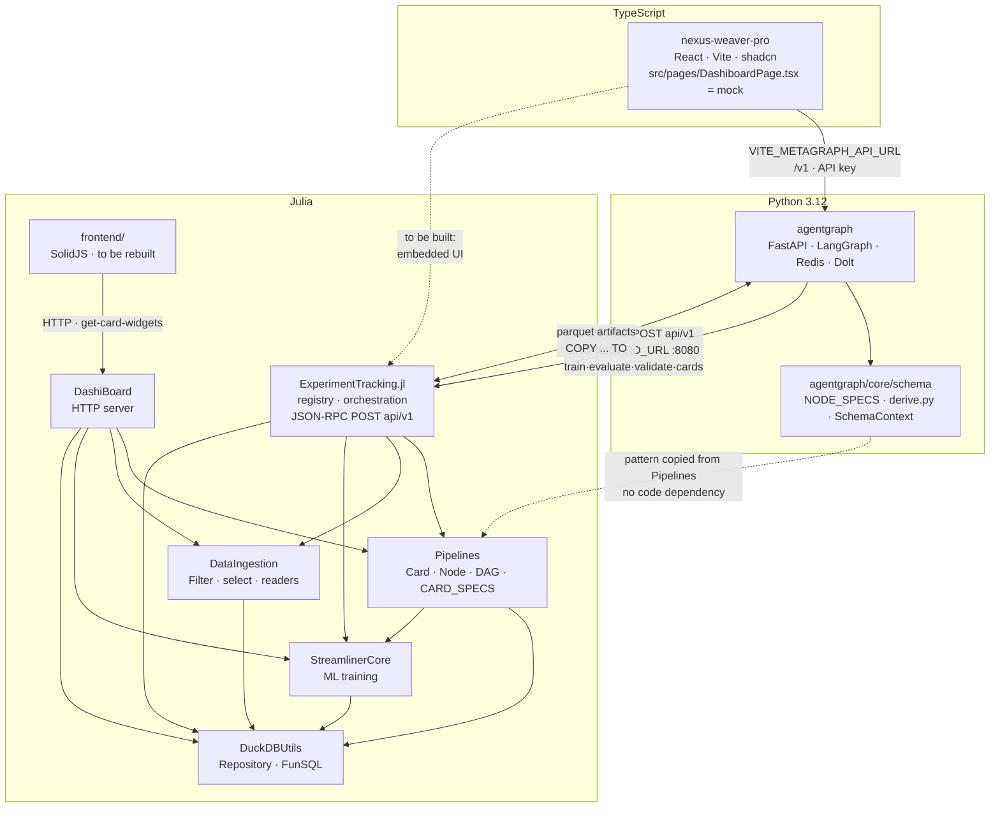

# 02 — The four projects and how they connect

Established by reading source, not by description. Every claim below was verified in a
manifest or in calling code unless marked `INFERRED`. Correct anything wrong here in your own
brief.

## The graph



## ExperimentTracking.jl

A sibling of the `DashiBoard` server package, not a child: it depends on Pipelines,
DataIngestion, StreamlinerCore and DuckDBUtils, and wraps the same core with a different API.
It orchestrates several pipelines over one source and records each run in a registry (DuckDB,
or Postgres via `external_database.jl`).

**Its API.** `get_router` registers one JSON-RPC endpoint, `POST api/v1`
(`src/api/router.jl:19-28`), with five methods (`src/api/handlers.jl:1-15`):

| Method | Returns |
|---|---|
| `cards` | `{type: {label}}` from `Pipelines.CARD_SPECS` |
| `schema` | takes `{cards, vars}`, returns `card_schema(k, vars)` per type — JSON Schema already specialised to the available variables (`handlers.jl:138-145`) |
| `validate` | `{valid, source_vars, output_vars}`, from the same parse `train`/`evaluate` use (`handlers.jl:83-90`) |
| `train` | runs and persists, saving fitted node state |
| `evaluate` | runs, optionally warm-starting from a prior run |

Progress is opt-in: passing `run_id` wraps the callbacks and emits events.

**Its data model** (`src/schema.jl:30-42`): `Config = {filters, nodes, groups}`,
`DataFlow = {id_var, source, destination, schema, database}`, `Run` with a `from` lineage
field, `Result = {reports}`, and `Entry` combining all four as one registry row. Its example
config (`test/static/configs/config.toml`) is a DashiBoard pipeline document plus a
`[[filters]]` section.

**The two Julia servers have disjoint capabilities.** Both default to port 8080, and the one
named DashiBoard is *not* the one AgentGraph talks to.

| `DashiBoard/src/launch.jl` | ExperimentTracking `api/v1` |
|---|---|
| `/get-acceptable-paths` — browse the data directory | — |
| `/load-files` — ingest files | — |
| `/get-card-widgets` — widget JSON | `cards` + `schema` — supersedes it |
| `/evaluate-pipeline` — run, plus Graphviz DOT | `train` / `evaluate` — no DOT, different result shape |
| `/fetch-data` — paged rows | — |
| `GET /get-processed-data` — download | — |
| — | `validate` |
| — | registry, `Run.from` lineage, `run_id` progress events |

Only `get-card-widgets` is genuinely superseded. The other five have no ExperimentTracking
counterpart, and a UI with a source picker, a spreadsheet and a rendered graph needs all of
them. See §12 of `01-decisions.md`.

## agentgraph

Python 3.12: FastAPI, LangGraph, Redis, with a Dolt registry as the runtime source of record
and YAML graph configs whose edges are inferred from what each node consumes.

**It reaches DashiBoard through ExperimentTracking, and the bridge is built.**
`tools/remote_procedure.py` and `tools/platform/dashiboard.py` call
`POST {DASHIBOARD_URL}api/v1` (default `http://127.0.0.1:8080/`, 120 s timeout) under the
registry key `"dashi"`, generating `dashiboard_train` and `dashiboard_eval` from pydantic
payload schemas. `discover()` calls the `cards` method. The envelope's version field is
`version`, not `jsonrpc` — documented in the client as a deliberate deviation. Artifacts move
as parquet via `COPY ... TO`, the same mechanism on both sides.

**Its schema layer is Pipelines' pattern, carried further.**
`core/schema/__init__.py` states it directly: *"Modeled on DashiBoard/Pipelines: node types
register specs (NODE_SPECS), JSON Schemas are DERIVED from the typed models (never
hand-written), and contextual enums (tool keys, model ids) are injected at generation time.
The same derived schemas serve the designer LLM, validation, and the UI."* `derive.py` adds
that it *"Mirrors Pipelines' options_schema/conditional_options_schema"*.

`SchemaContext` is `VariableConfig` by another name, and `GET /v1/graphs/schema` is the
endpoint DashiBoard lacks. There is no code dependency in either direction — the value is that
the design DashiBoard is about to attempt has already been built once, downstream, from its
own idea.

**Its services API** (`api/routes_services.py`) is the connection directory: `GET /v1/services`
projects each registered spec with per-field connection provenance,
`PUT|DELETE /v1/services/{service}/connection` edits the override, and
`GET /v1/services/{service}/health` runs `discover()`.

## nexus-weaver-pro

React, Vite, TypeScript, shadcn/Radix, Tailwind, TanStack Query, react-hook-form, zod,
ag-grid-react. It reaches agentgraph through a single base URL
(`VITE_METAGRAPH_API_URL`, e.g. `http://127.0.0.1:8000/v1`) with `VITE_METAGRAPH_API_KEY`;
the client is `src/lib/api.ts`.

`src/pages/DashiboardPage.tsx` is an 822-line **mock** with an invented data model —
`PipelineNode` carrying a `layer`, `PipelineConnection` carrying `conditions`, node types
`source|filter|transform|model|metric|visualization|export` — plus a simulated execution and a
`GraphMinimap`. It assumes user-drawn connections, which DashiBoard's model cannot support.
It is evidence of what the host expected, not a specification.

**There is no direct connection between this app and any Julia service today.** The only live
path is nexus-weaver-pro → agentgraph → ExperimentTracking → Pipelines.

## How a DashiBoard pipeline is invoked from AgentGraph

The integration is artifact-mediated
(`agentgraph:src/agentgraph/tools/platform/dashiboard.py:145-193`):

```
   DashiBoard UI (standalone, or embedded in nexus-weaver-pro)
                    |
                    |  authors and saves
                    v
   pipeline_artifact  (structured_data: {nodes, groups, filters})
                    |
                    |  ConfigInput: uuid pins a version, alias resolves latest;
                    |  loaded client-side to fill payload fields, never sent on the wire
                    v
   an AgentGraph node: dashiboard_train / dashiboard_eval
                    |
                    |  + source_artifact (ArtifactInput, parquet path -> dataflow.source)
                    |  fixed: dataflow.file_based = true
                    v
   JSON-RPC POST api/v1  ->  ExperimentTracking  ->  Pipelines
                    |
                    v
   destination artifact (parquet: source table + pipeline output columns)
```

The config carries no `DataFlow`: source and destination are bound per invocation.
`content_metadata["required_columns"]` on the config artifact is checked against the source
table's recorded columns before any HTTP call (`dashiboard.py:74-84`).

## Out of scope and unverified

`AgentGraph/` (capital — a Typst report, unrelated to `agentgraph/`), `AgentAutoTrading`,
`Streamliner.jl` (distinct from the in-repo `StreamlinerCore`), `My_PipelinesExtras` and the
other Limen projects were not read. If any of them depends on Pipelines or ExperimentTracking,
this graph is incomplete — say so.
