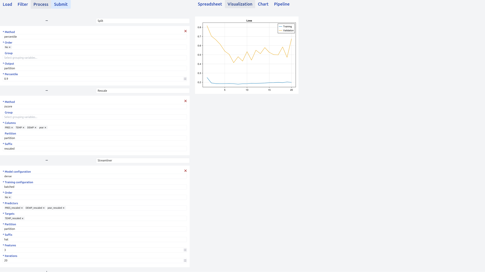

# Deep Learning Guide

DashiBoard supports training and evaluating deep learning models via the [StreamlinerCore](@ref) package.

Streamliner cards can be inserted into any pipeline and receive / provide data to/from any other card.

## Setup

As designing a deep learning model and devising a training procedure are complex tasks, DashiBoard
reads them from configuration files: the workspace's `model/` and `training/` folders, or the
folders given with `--model_dir` and `--training_dir` (see `bin/README.md`). The repository's
`static/model` and `static/training` folders hold examples.

When using a streamliner card, DashiBoard reads those folders and derives the card's form from
them: each configuration's `[[properties]]` entries become fields, carrying their `title`,
`description` and constraints into the schema the UI renders.

## Visualization

The streamliner card comes with a default visualization (see [`Pipelines.visualize`](@ref)), displaying the trajectory of the loss function in the training and validation datasets.

## Example pipeline

Below we see a typical deep learning pipeline, comprised of the following steps:

- data partition,
- data normalization,
- model training and evaluation.

