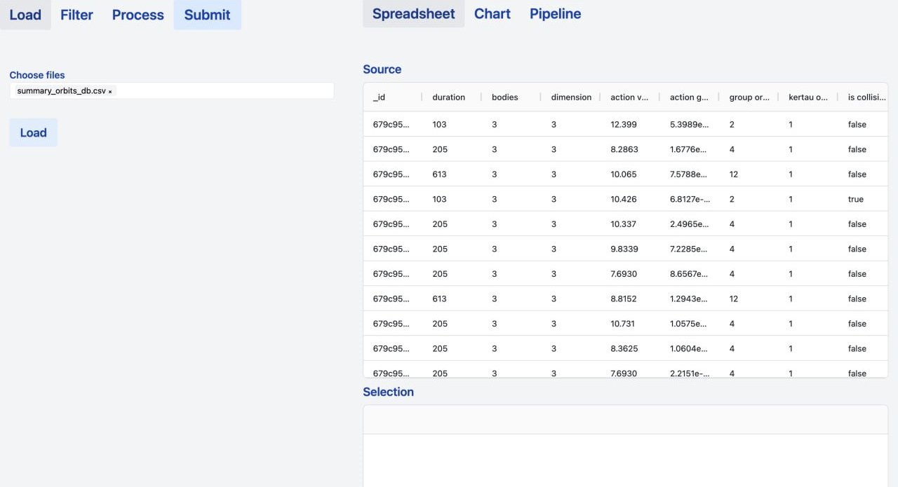

# N-Body Problem Guide

The data is prepared and saved as `.csv` files, representing trajectories with their key attributes.

We use two data representations:
1. Each orbit is seen a sequence of points in the `(x,y,z)`-space, so that each row is an instant photo of a trajectory in the space (`orbits_db.csv`);

2. Each orbit is an object which contains its time duration as a trajectory among its attributes (`summary_orbits_db.csv`). This is a compact representation of data, useful to predict qualitative attributes which do not involve the geometric shape of orbits.

Once the `.csv` files are created, it is enough to place them in the `./data` folder in order to be processed in DashiBoard.
Once the frontend is launched, it is enough to choose among the available files in the "Load" page

In the "Filter" page, it is possible to filter the loaded db. Filters range among the attributes of the Trajectory dataclass. Once the desired parameters are set, the "Submit" button provides the filtered db.

In the "Process" page it is possible to select one of the available cards which provide data analysis tools.
For instance, the "Split" card returns partitions of the dataset with a prescribed order and grouping.

