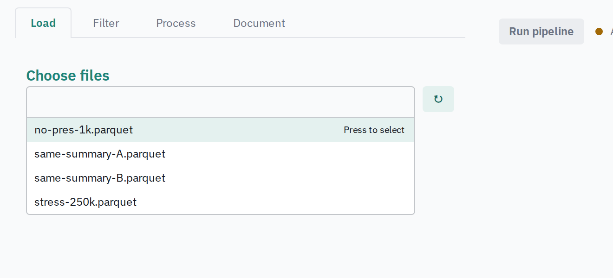
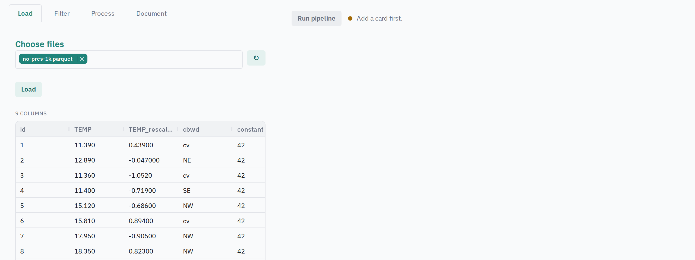
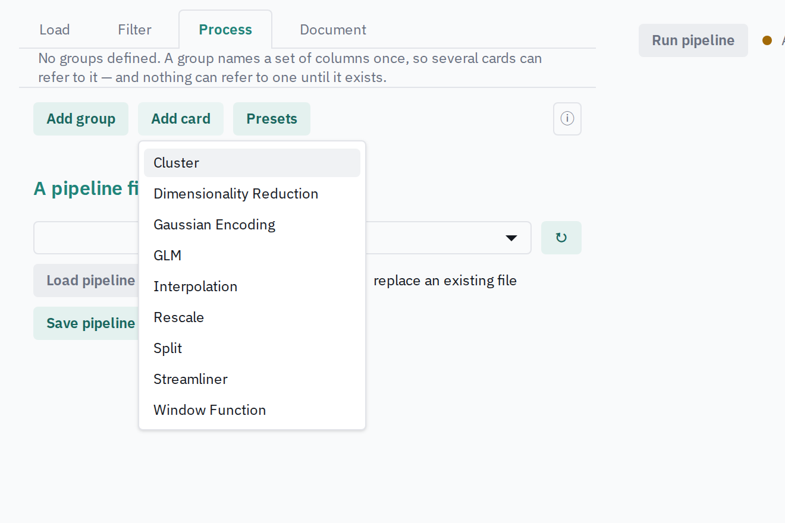
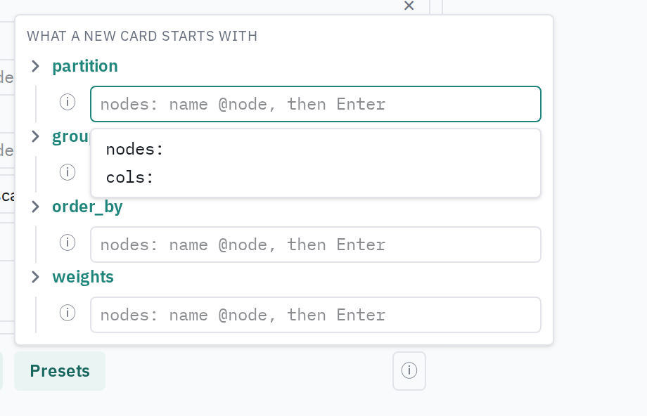
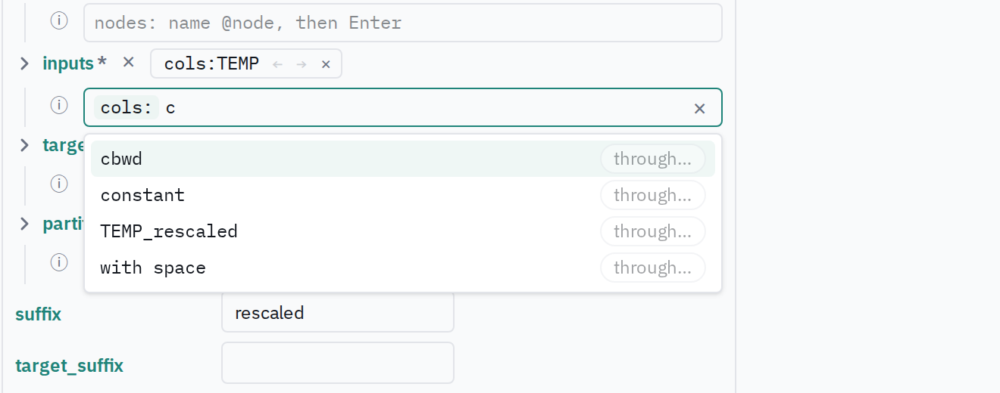

# UI Guide

The UI is a browser page in two halves: on the left what you are building — the data, the filters,
the pipeline — and on the right what the last run produced.

This guide has two parts. [Using it](@ref) is for anyone in front of the page. [Working on it](@ref)
is for whoever will read or change the code.

## Running it

Two processes. In one terminal, at the top of the repository, the Julia server — it holds the data
and answers every question the page asks:

```
julia --project=DashiBoard bin/launch.jl path/to/data
```

`path/to/data` is the only folder the page can reach: tables, pipelines and filter documents are
read from and written to it, and nothing outside it is ever listed.

In a second terminal, the UI:

```
cd dashiboard-ui
pnpm run start
```

Then open [http://localhost:3000](http://localhost:3000). The dev server forwards every API call
to the Julia server, so the page and the API share an origin exactly as they will when the built
bundle is served beside the server.

Both need their dependencies installed once; see [Getting Started](@ref).

---

# Using it

## The four tabs

| tab | what it is for |
|---|---|
| **Load** | choose one or more files from the data folder and load them as the source table |
| **Filter** | narrow the rows: checkboxes for categorical columns, bounds for numeric ones |
| **Process** | build the pipeline — the groups and cards that add columns |
| **Document** | the exact JSON that will be sent when you run |

The right-hand side shows what the last run produced: the output table, any plots the cards drew,
the graph of how the cards relate, and each card's report.

## Loading data

Pick files in the **Load** tab and press `Load`. Only the data folder is listed, and only files
DashiBoard can read.



The table appears on the right, and its columns become the vocabulary every picker offers from
then on.



## Building a pipeline

The **Process** tab holds three kinds of thing, and one row of actions at the foot of the list:

```
[Add group] [Add card] [Presets]                                  ⓘ
```

### A card

`Add card` opens a menu of card types. Picking one adds the card at the end of the pipeline and
puts the cursor in its name box — the name is what other cards refer to it by.



A card is folded to one line: its type, its name, and a dot saying where it stands. Unfold it to
fill in its fields. At its foot are three buttons:

- **Confirm** asks the server about this card alone and marks it green or red.
- **Clear** empties it back to what a new card of that type would hold.
- **Remove** deletes it.

The dot beside the name is amber until you ask, green or red once the server has answered, and
amber again the moment you edit — an answer is only ever about the content it was given.

### A group

`Add group` adds a named set of columns, so several cards can refer to one list instead of
repeating it. A group is edited with the same picker a card's field uses, and carries the same
three buttons.

Nothing can refer to a group until it exists, which is why groups are listed above the cards.

### Presets

Cards usually share the same `partition`, `order_by`, `group_by` and `weights`. `Presets` opens a
small panel where you set those once; **every card created afterwards starts with them**. Cards
already on the page are never touched, and clearing a preset only affects the next card.



The list of fields is not hard-coded: it is every field at least two card types share, minus what
a card actually operates on (`inputs`, `targets`, `input`).

## Choosing columns: the selector field

Wherever a card asks for columns, you get the same control, and it accepts three kinds of thing:

- **cols** — a column of the loaded table;
- **groups** — a group you defined;
- **nodes** — everything another card produced.

Each choice may also pass **through** one or more cards, which names the column that card made
from it. A chain is ordered: `→ impute → zscore` is not `→ zscore → impute`.

The field shows what it holds as chips beside its name, and offers two ways to add to it.

### By typing

The box under the name takes `kind`, then a name, then optional pass-through steps:

```
cols:  bill_length  →impute  →zscore
```

| key | effect |
|---|---|
| `c`, `g` or `n` then `Tab` | choose cols, groups or nodes |
| type, then `Tab` | take the top match; `↑` `↓` choose another |
| a node name after a name | pass through it; repeat for a chain |
| `Enter` | add it, as a chip |
| `Backspace` | undo the last part |
| `Esc` | close the list, then clear the box |
| `Tab` with nothing typed | leave the field |
| `←` from the empty box | reach the chips: `Delete` removes, `Alt`+`←`/`→` reorder |
| `F1` | show these keys |



The list of suggestions is always showing while the box has the caret, and nothing is highlighted
until you type or press `↓` — so `Tab` never takes a choice you did not make.

### By clicking

Unfold the field to get the same vocabulary as a list, one tab per kind. Clicking a **name** adds
it directly; `through…` opens the nodes it may pass through, which you switch on in the order you
want them, then `add`.

Only nodes that can actually take the value further are offered, and a card is never offered
itself or anything that depends on it — those would make a loop the server refuses.

## Running

`Run pipeline`, top right. Beside it a dot says whether what is on screen has been run, and a line
names anything that was asked about and refused. A pipeline can be run even so: the line says
where to look, it does not stop you.

## Saving

At the foot of the Process tab, `Load pipeline`, `Save pipeline` and `Download pipeline` work on
the whole document — its groups and its cards — in the server's data folder. Presets are yours,
not the pipeline's, and are not saved with it.

---

# Working on it

## Where things are

| path | what lives there |
|---|---|
| `dashiboard-ui/src/stores.ts` | the document, the filters, the verdicts, the presets — all module-level stores |
| `dashiboard-ui/src/left-tabs/` | the four sections of the left pane |
| `dashiboard-ui/src/components/` | the controls, chiefly `SelectorField` and `IRField` |
| `dashiboard-ui/src/ir.ts` | the server's card description turned into widget descriptors |
| `dashiboard-ui/src/selector.ts`, `selectorEntry.ts`, `through.ts` | the selector's model, its typed grammar, and which chains are possible |
| `DashiBoard/src/handlers.jl` | every route the page calls |

## Three ideas the code rests on

**The store is the document.** What is saved is the JSON that was authored, never a reconstruction
from widget values. The stores are kept in `sessionStorage`, so a reload does not lose the work and
two tabs do not overwrite each other.

**The server owns names.** A `through` chain names a column by concatenating card suffixes, and
that rule lives in `Pipelines`. The UI never computes a resolved column name; it writes the
document and asks the server what it got. `POST /probe-pipeline` answers on every edit with each
card's inputs and outputs, what nothing produces, and what each item may refer to without a loop.

**Red means you asked.** An item is amber until a Confirm, a load or a run puts a question to the
server. A verdict is bound to the exact content that was asked about, so any edit expires it. The
continuous probe never turns anything red by itself.

## The selector, in code

`SelectorField` draws one field. Its model is a list of *items* — `{cols: [...], through: [...]}`
as the document holds them — expanded into *rows* of one value each for editing, and collapsed back
on write (`selector.ts`). The same value may appear twice under different pass-through chains,
which is why a row carries its chain.

`selectorEntry.ts` is the typed grammar as a pure state machine: `kind → name → chain → finish`,
with no DOM, so every key in the table above is tested as data. `through.ts` decides which cards a
chain may pass through next, from what the probe said each card reads and writes.

## Tests

```
cd dashiboard-ui && npx vitest run     # the UI
julia --project=DashiBoard/test DashiBoard/test/dashiboard.jl    # the routes
```
