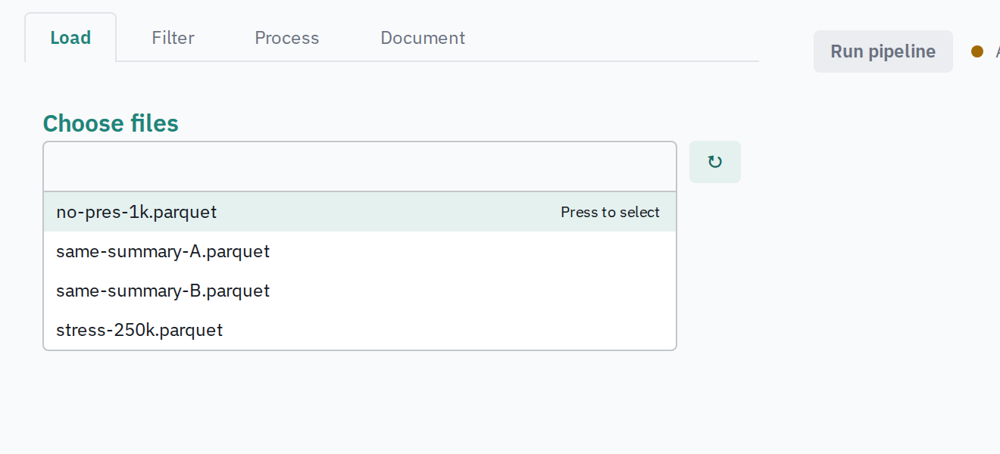
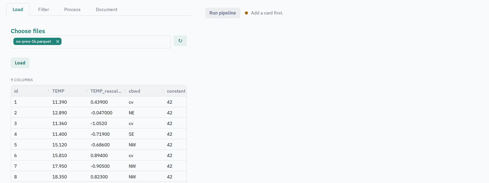
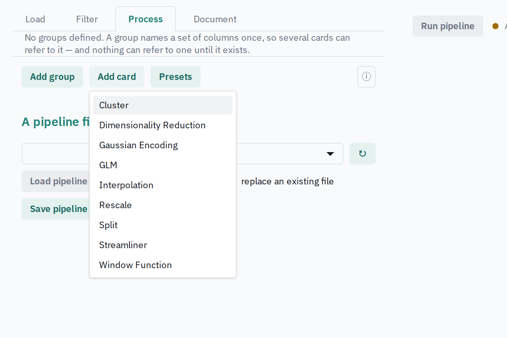
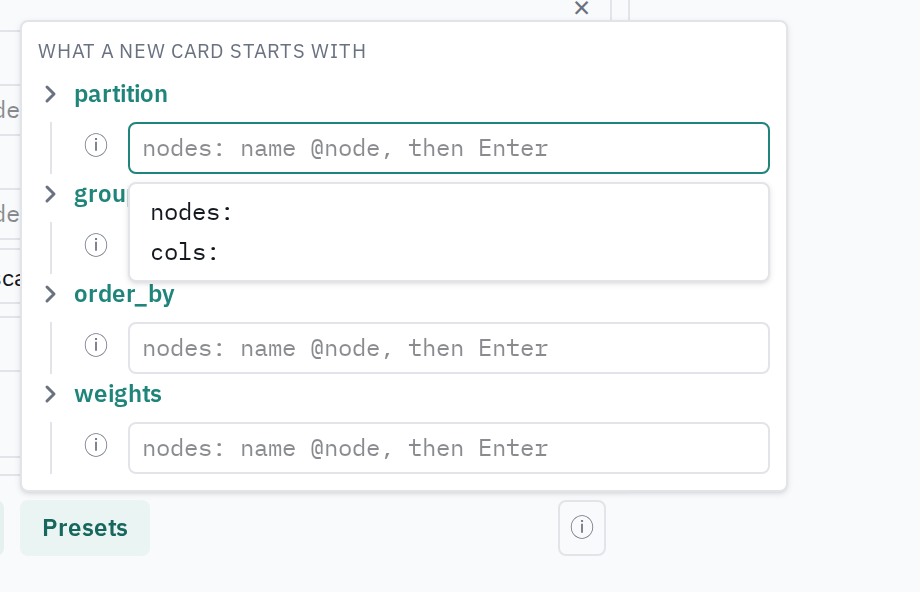
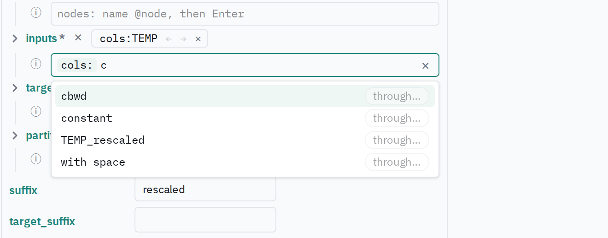

# UI Guide

The UI is a browser page in two halves: on the left what you are building — the data, the filters,
the pipeline — and on the right what the last run produced.

This guide has two parts. [Using it](@ref) is for anyone in front of the page. [Working on it](@ref)
is for whoever will read or change the code.

## Running it

Two processes. In one terminal, at the top of the repository, the Julia server — it holds the data
and answers every question the page asks:

```
julia --project=DashiBoard bin/launch.jl path/to/workspace
```

`path/to/workspace` is the folder the page works in. Laid out, it has a folder per kind of
file — `data/` for tables, `pipeline/` and `filter/` for the documents, `model/` and `training/`
for the configurations — and the page lists, loads and saves each kind in its own folder; nothing
outside those folders is ever listed. A plain folder works too, with everything read from the
root. `bin/README.md` has the layout, the
`dashiboard.toml` that can name the folders and the extensions to load, and `--init`, which sorts
a plain folder into the layout.

In a second terminal, the UI:

```
cd dashiboard-ui
pnpm run start
```

Then open [http://localhost:3000](http://localhost:3000). The dev server forwards every API call
to the Julia server, so the page and the API share an origin exactly as they will when the built
bundle is served beside the server.

Both need their dependencies installed once; see [Getting Started](@ref).

---

# Using it

## The four tabs

| tab | what it is for |
|---|---|
| **Load** | choose one or more files from the data folder and load them as the source table |
| **Filter** | narrow the rows: checkboxes for categorical columns, bounds for numeric ones |
| **Process** | build the pipeline — the groups and cards that add columns |
| **Document** | the exact JSON that will be sent when you run |

The right-hand side shows what the last run produced: the output table, any plots the cards drew,
the graph of how the cards relate, and each card's report.

## Loading data

Pick files in the **Load** tab and press `Load`. Only the workspace's `data/` folder is listed,
subfolders included, and only files DashiBoard can read.

A file that sits in a folder but is not what that folder holds — a filters document saved under
`pipeline/`, say — is not offered; the picker says so in amber under its list, so you know where
it is and what it was taken for.



The table appears on the right, and its columns become the vocabulary every picker offers from
then on.



## Building a pipeline

The **Process** tab holds three kinds of thing, and one row of actions at the foot of the list:

```
[Add group] [Add card] [Presets]                                  ⓘ
```

### A card

`Add card` opens a menu of card types. Picking one adds the card at the end of the pipeline and
puts the cursor in its name box — the name is what other cards refer to it by.



A card is folded to one line: its type, its name, and a dot saying where it stands. Unfold it to
fill in its fields. At its foot are three buttons:

- **Confirm** asks the server about this card alone and marks it green or red.
- **Clear** empties it back to what a new card of that type would hold.
- **Remove** deletes it.

The dot beside the name is amber until you ask, green or red once the server has answered, and
amber again the moment you edit — an answer is only ever about the content it was given.

### A group

`Add group` adds a named set of columns, so several cards can refer to one list instead of
repeating it. A group is edited with the same picker a card's field uses, and carries the same
three buttons.

Nothing can refer to a group until it exists, which is why groups are listed above the cards.

### Presets

Cards usually share the same `partition`, `order_by`, `group_by` and `weights`. `Presets` opens a
small panel where you set those once; **every card created afterwards starts with them**. Cards
already on the page are never touched, and clearing a preset only affects the next card.



The list of fields is not hard-coded: it is every field at least two card types share, minus what
a card actually operates on (`inputs`, `targets`, `input`).

## Choosing columns: the selector field

Wherever a card asks for columns, you get the same control, and it accepts three kinds of thing:

- **cols** — a column of the loaded table;
- **groups** — a group you defined;
- **nodes** — everything another card produced.

Each choice may also pass **through** one or more cards, which names the column that card made
from it. A chain is ordered: `→ impute → zscore` is not `→ zscore → impute`.

### Cards that write more than one thing

Most cards write one thing for each column they are given: `rescale` writes `PRES_rescaled`. A
card can write several, and then each has a name. A streamliner card whose model predicts a value
*and* how sure it is writes two — `prediction` and `logvar` — so a target `Iws` comes out as
`Iws_hat` and `Iws_logvar`. The prediction takes the card's `suffix`; everything else is named
after itself.

Passing through such a card takes everything it writes, unless you say which:

```
cols:  Iws  →fit                      Iws_hat and Iws_logvar
cols:  Iws  →fit|logvar               Iws_logvar
cols:  Iws  →fit|logvar|prediction    Iws_logvar, then Iws_hat
```

The card itself decides what is written at all. When the model chosen yields more than one thing,
the card shows a `select` field listing them, all taken to begin with; untick one and its column
is never written. A model that yields one thing has nothing to choose, and the field is not shown.

### Building a streamliner card

A streamliner card trains a model and writes its predictions. It has three parts.

**model** and **training** each list the configurations in the workspace's `model/` and
`training/` folders. Choosing one shows the file itself, folded under the name, so what the
configuration fixes — layers, loss, optimizer — can be read without opening it, and the settings
it leaves open — the number of features, the number of iterations — as controls. The `↻` beside
the name lists the folders again, for a file added while the server runs. When there is only one
configuration there is nothing to choose, and its file and settings are shown straight away.

**funnel** says which rows and columns the model is fed:

- `order_by` — the columns that put the rows in order. Required.
- `inputs` — the columns the model reads.
- `targets` — the columns it learns to predict.

All three are the same picker every other card uses, so an input can be a column, a group, or
what another card produced.

Under `inputs` and under `targets` there is one row per column with a **transform**: `identity`,
which leaves the column as it is, or `log`, `log1p`, `sqrt`, `asinh`. Two things to know:

- A transformed *target* is predicted in transformed units. Nothing converts the predictions
  back.
- A transform is applied as written. `log` of a value that is not positive is not caught.

A row marked *not among the inputs* is a transform left over for a column the list no longer
reaches — after an upstream card was renamed, say. The server refuses it; `remove` clears it.
A categorical column has no transform to choose.

`Presets` fill `order_by` here as they do on any other card.

When the server is launched with an extension that adds another kind of funnel, `funnel` gains a
`type` to choose, where `default` is the one described above.

The field shows what it holds as chips beside its name, and offers two ways to add to it.

### By typing

The box under the name takes `kind`, then a name, then optional pass-through steps:

```
cols:  bill_length  →impute  →zscore
```

| key | effect |
|---|---|
| `c`, `g` or `n` then `Tab` | choose cols, groups or nodes |
| type, then `Tab` | take the top match; `↑` `↓` choose another |
| a node name after a name | pass through it; repeat for a chain |
| `|` after a node | keep only some of what it writes |
| `Enter` | add it, as a chip |
| `Backspace` | undo the last part |
| `Esc` | close the list, then clear the box |
| `Tab` with nothing typed | leave the field |
| `←` from the empty box | reach the chips: `Delete` removes, `Alt`+`←`/`→` reorder |
| `F1` | show these keys |



The list of suggestions is always showing while the box has the caret, and nothing is highlighted
until you type or press `↓` — so `Tab` never takes a choice you did not make.

### By clicking

Unfold the field to get the same vocabulary as a list, one tab per kind. Clicking a **name** adds
it directly; `through…` opens the nodes it may pass through, which you switch on in the order you
want them, then `add`.

Only nodes that can actually take the value further are offered, and a card is never offered
itself or anything that depends on it — those would make a loop the server refuses.

A node that writes several things shows them under its pill once it is switched on: `keep only`,
then one switch per name. None switched on keeps them all.

## Running

`Run pipeline`, top right. Beside it a dot says whether what is on screen has been run, and a line
names anything that was asked about and refused. A pipeline can be run even so: the line says
where to look, it does not stop you.

## Saving

At the foot of the Process tab, `Load pipeline` and `Save pipeline` work on the whole document —
its groups and its cards — in the workspace's `pipeline/` folder; the name you type is relative to
it, ends in `.json`, and may name a subfolder (`experiments/first.json`). Filters are saved the same way in `filter/`.
Presets are yours, not the pipeline's, and are not saved with it.

`Download pipeline` gives you a zip, named after the file name without its `.json`, laid out as a
workspace: the document under `pipeline/`, the
model and training configurations it names under `model/` and `training/`, the filters under
`filter/` when the Filters tab holds some, and a `dashiboard.toml` naming the extensions the
document needs, each with the path it was loaded from on this machine. Unpacked beside the table,
it is a workspace that launches and runs the same pipeline; on another machine, the paths in its
`dashiboard.toml` are the one thing to edit. The data is not in it.

---

# Working on it

## Where things are

| path | what lives there |
|---|---|
| `dashiboard-ui/src/stores.ts` | the document, the filters, the verdicts, the presets — all module-level stores |
| `dashiboard-ui/src/left-tabs/` | the four sections of the left pane |
| `dashiboard-ui/src/components/` | the controls, chiefly `SelectorField` and `IRField` |
| `dashiboard-ui/src/ir.ts` | the server's card description turned into widget descriptors |
| `dashiboard-ui/src/selector.ts`, `selectorEntry.ts`, `through.ts` | the selector's model, its typed grammar, and which chains are possible |
| `DashiBoard/src/handlers.jl` | every route the page calls |

## Three ideas the code rests on

**The store is the document.** What is saved is the JSON that was authored, never a reconstruction
from widget values. The stores are kept in `sessionStorage`, so a reload does not lose the work and
two tabs do not overwrite each other.

**The server owns names.** A `through` chain names a column by concatenating card suffixes, and
that rule lives in `Pipelines`. The UI never computes a resolved column name; it writes the
document and asks the server what it got. `POST /probe-pipeline` answers on every edit with each
card's inputs and outputs, what nothing produces, and what each item may refer to without a loop.

**Red means you asked.** An item is amber until a Confirm, a load or a run puts a question to the
server. A verdict is bound to the exact content that was asked about, so any edit expires it. The
continuous probe never turns anything red by itself.

## The selector, in code

`SelectorField` draws one field. Its model is a list of *items* — `{cols: [...], through: [...]}`
as the document holds them — expanded into *rows* of one value each for editing, and collapsed back
on write (`selector.ts`). The same value may appear twice under different pass-through chains,
which is why a row carries its chain.

`selectorEntry.ts` is the typed grammar as a pure state machine: `kind → name → chain → finish`,
with no DOM, so every key in the table above is tested as data. `through.ts` decides which cards a
chain may pass through next, from what the probe said each card reads and writes.

## Tests

```
cd dashiboard-ui && npx vitest run     # the UI
julia --project=DashiBoard/test DashiBoard/test/dashiboard.jl    # the routes
```
