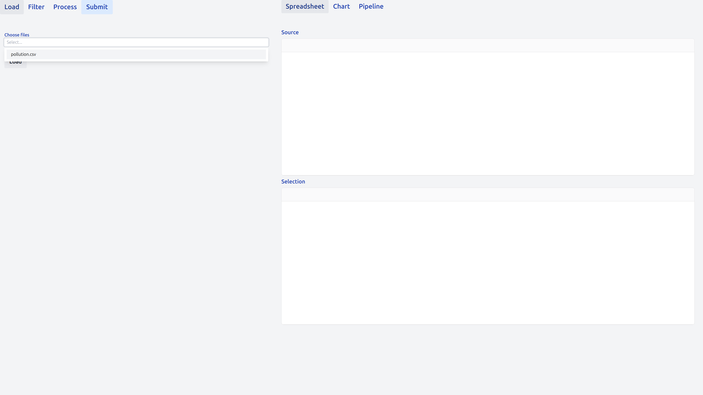

# UI Guide

## Home screen

After opening the browser at the starting page (see [Getting Started](@ref)),
you will be greeted by the following page.

## Loading data

To load data, simply select one or more files from the "Choose files" dropdown.

You will have access to all the files available in you data directory, provided
that their format is supported. See also [`DataIngestion.is_supported`](@ref).

Upon pressing the `Load` button, the data is loaded in the `Source` table,
displayed on the top right.

## Filtering data

The `Filter` tab allows users to filter their data.
At the moment, we support checkboxes for categorical columns and min / max
selectors for continuous ones.

Upon clicking on `Submit`, the filtered data is loaded in the `Selection` table,
displayed on the bottom right.

## Processing data

Data is processed via cards, small building blocks that add new columns to the 
filtered data.

To add a new card, click on the `＋` and select the type of card you wish to add.

You can add and compile as many cards as you wish.

Upon clicking on `Submit`, the additional columns are added to the `Selection` table.

